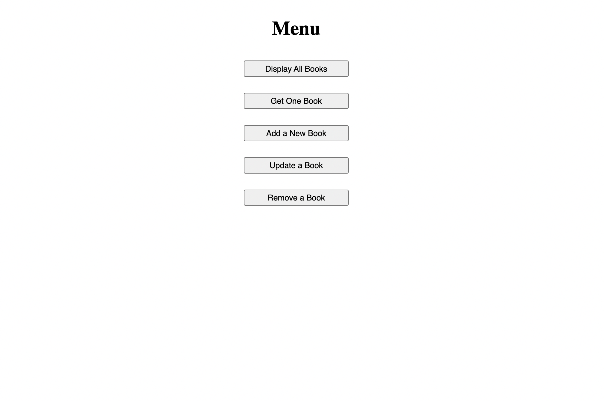
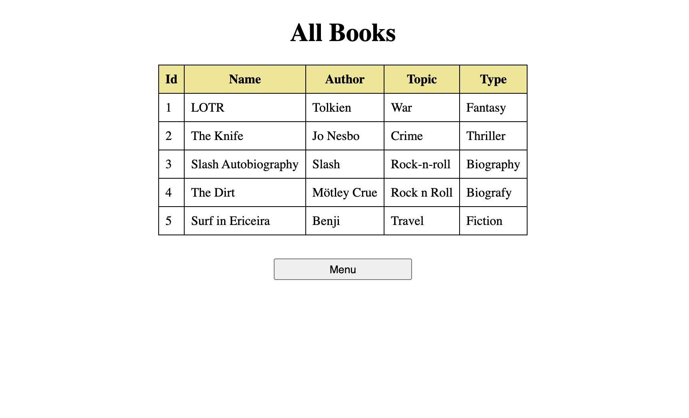

# Tasks

1. Create a folder for the project
2. Write create statements for the database
3. Create the database
4. Create sql statements for accessing the data
5. Create data access layer for the data
6. Create REST server (indexREST.js)
7. Create a single-page application to use the data
8. Create a SPA server (indexSPA.js)

### 1 Create a folder for the project

- Create a folder for the project. Name the folder with Kantanen_Heikki_book_project.
- Generate or write the package.json file for the project.
- Install mariadb library into the project folder.
- Install all necessary libraries to the project.

### 2 Write create statements for the database

- Write create statements to create a database called `'bookdb'`.
- Create a table book, for book data. Table columns are:

```json
bookID integer
name varchar(50)
author varchar(18)
topic varchar(13)
type varchar(18)
```

- All columns are mandatory. The primary key is bookID.
- Add two insert statements into the create statements for testing.
- Create user mia@localhost with password sjmJOXDA. Grant all necessary privileges to the user.
- Save all necessary create statements into a json file `'Kantanen_Heikki_book_createStatements.json'`

### 3 Create the database

- Create the database with the create statements `'Kantanen_Heikki_book_createStatements.json'`

### 4 Create sql statements for accessing the data

- With sql statements you should be able to

  - select
  - insert
  - update
  - delete

#### Select

- `get` all
- `get` using primary key bookID as a key.

#### Insert

- Data can be added. Primary key is `bookID` .

#### Update

- All data except primary key ( `bookID` ) can be updated. Primary key `bookID` serves as a selection criterion.

#### Delete

- Data can be deleted using primary key `bookID` as criterion.

### 5 Create data access layer for the data

- Create a datastorage layer with all necessary methods:
  - get all
  - get one
  - insert
  - update
  - remove

### 6 Create REST server (indexREST.js)

- Create a REST server. Server is listening host `localhost:4000`. Allow cross-origin requests (Cross-Origin Resource Sharing).
- REST API:
  Create REST API. The resouces of the REST API are given and returned in json format. The API should include following:
  - Get all
    GET /api/books
  - Get book
    GET /api/books/bookID Example: GET /api/books/1
  - Insert book data
    POST /api/books
  - Update
    PUT /api/books/bookID
  - Delete book
    DELETE /api/books/bookID Example: DELETE /api/books/1

### 7 Create a single-page application to use the data

- Create a single-page web application. Use fetch to manipulate data.
- Create the following operations:
  - get all
  - get one
  - insert
  - remove
- Design and implement the main menu and all other necessary pages.
- Design and implement stylesheets for your application.

### 8 Create a SPA server (indexSPA.js)

- Create a server to serve single page aplication and necessary resources (html, css, js, etc.). Server is listening host localhost:3000. Main page can be opened from root route /

## Application screenshots



